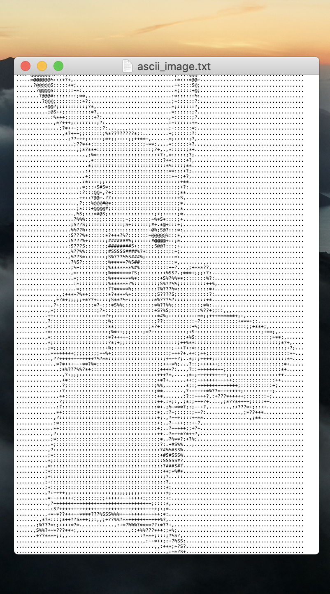

# artscii
Generate ascii art from images.

#### Installation
1. Create virtual env: `python3 -m venv <name>`
2. Activate virtual env: `source <name>\bin\activate`
3. Install libs: `pip install -r requirements.txt`

#### JPEG conversion
For converting JPEG images your OS might need a JPEG encoder.
```
brew install libjpeg
```

#### Run 
```
python artscii.py
```

 